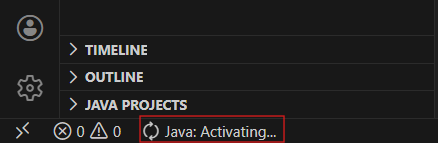
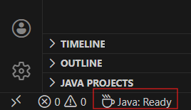

# Automated Javadocs

**Automated Javadocs** is a VS Code extension that automatically generates **Javadoc comments for Java methods and constructors using AI.**

Instead of manually writing documentation, the extension analyzes your Java file, sends the relevant information to an AI backend, and inserts fully formatted Javadoc blocks directly into your code.

The extension detects:

- methods
- constructors
- parameters
- return values
- declared exceptions

And generates documentation including:

- method descriptions
- `@param` descriptions
- `@return` descriptions
- `@throws` descriptions

# Demo video

Here is a link to the demo of this extension

https://youtu.be/oiPKy4F0CKA 


# Features

## Automatic Javadoc Generation

Automatically generate Javadocs for every method and constructor in a Java file.

The extension:

1. Scans the Java file using the VS Code Java language server
2. Extracts method signatures
3. Sends the file and signatures to the backend AI service
4. Receives structured documentation
5. Inserts Javadoc blocks above each method

### Example

**Before**

```java
public String getName() {
    return name;
}
```

 **After running** `Automated Javadocs: Inject Javadocs`

 ```java
/**
 * Returns the current name.
 * @return the name associated with this object
 */
public String getName() {
    return name;
}
 ```

 Parameter Documentation
-----------------------

Parameters are automatically documented.

```java
/**
 * Updates the user's name.
 * @param name the new name to assign
 */
public void setName(String name) {
    this.name = name;
}
```

Exception Documentation
-----------------------

Declared exceptions are documented.
```java
/**
 * Parses a configuration file.
 * @param path the file path to read
 * @throws IOException if the file cannot be read
 */
public void loadConfig(String path) throws IOException {}
```

Skips Existing Javadocs
-----------------------

The extension **does not overwrite existing documentation.**

If a method already has a Javadoc block, it will be skipped.

Architecture
============

The extension uses a **secure backend architecture**.

```
VS Code Extension
       │
       │ HTTP request
       ▼
Backend Service (Node.js / Express)
       │
       │ OpenAI API request
       ▼
OpenAI Responses API

```

This design prevents the **OpenAI API key from being exposed in the VS Code extension.**

The backend then returns **structured Javadoc comments for each method** back to the VS Code extention front end via JSON string, which contains the comments that were generated by the OpenAI Responses API.

Requirements
============

The extension requires the following:

Java Language Support in VS Code
--------------------------------

You must install the Java extension pack:

**Extension Pack for Java**

[https://marketplace.visualstudio.com/items?itemName=vscjava.vscode-java-pack](https://marketplace.visualstudio.com/items?itemName=vscjava.vscode-java-pack)

This provides the language server used to detect methods and constructors.

*Alternatatively, you can install just the official language support extension from RedHat if you don't want to install the entire Java extention pack*

***Java Language Support from RedHat***

https://marketplace.visualstudio.com/items?itemName=redhat.java

How to Use
==========
   
1.  Open a Java file in VS Code

2. Wait until it says something like "Java: Ready" in the bottom left corner

    It will initially look like this: 

    

    After the RedHat extensions have been initialized, it will look something like this:

    

3.  Open the command palette:
    - `Ctrl + Shift + P`

4.  Run:
    - `Automated Javadocs: Inject Javadocs`

The extension will:

*   Analyze the Java file
    
*   Generate documentation
    
*   Insert Javadoc blocks automatically

Known Issues
============

Java Extension Required
-----------------------

If Java language support is not installed, the extension cannot detect methods.

Large Files
-----------

Very large Java files may take longer to process due to AI request time.

Release Notes
=============

1.0.0
-----

Initial release of **Automated Javadocs**.

Features include:

*   automatic detection of Java methods and constructors
    
*   AI-generated Javadoc comments
    
*   parameter, return, and exception documentation
    
*   backend architecture for secure API usage
    

Development
===========

The extension is organized into several modules:

```
src/
  extension.ts        → VS Code command logic
  javaParser.ts       → Java method detection and parsing
  javadocGenerator.ts → Javadoc rendering and insertion
  openai.ts           → backend API client
``` 

Backend
-------
The backend implementation can be found here:

https://github.com/Nav-Codes/Automated-Javadocs-Backend